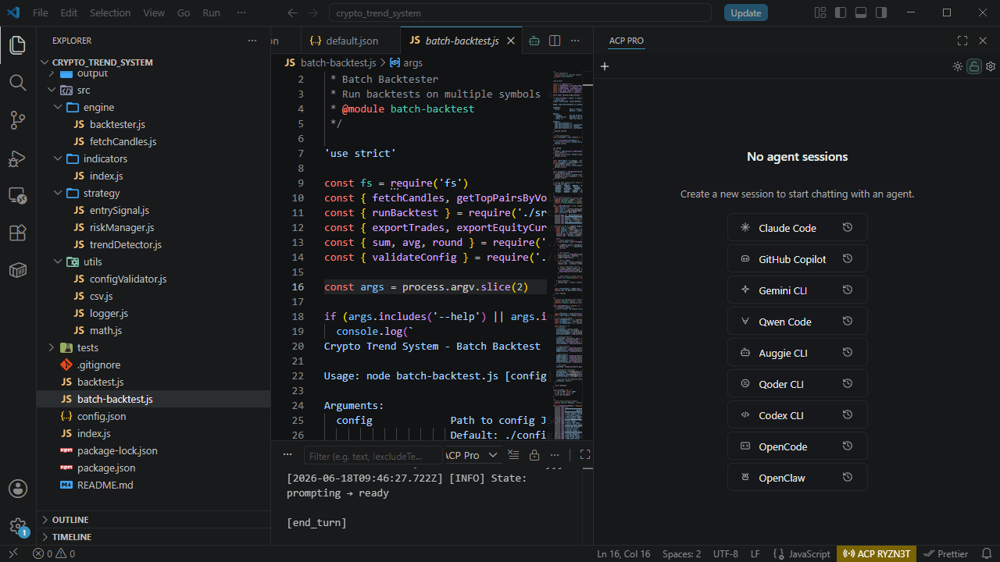

# ACP Pro

**One ACP client for every AI coding agent in VS Code.**

ACP Pro brings Agent Client Protocol coding agents into one VS Code workspace. Run Claude Code, Codex, Copilot, Gemini, Qwen Code, OpenCode, and other ACP-compatible agents side by side while keeping every task’s history, model, permissions, working directory, and git state isolated in its own tab.

[Product website](https://acp-pro.github.io) · [Visual Studio Marketplace](https://marketplace.visualstudio.com/items?itemName=duclvz.acp-pro) · [Open VSX](https://open-vsx.org/extension/duclvz/acp-pro) · [Pro license](https://duclvz.gumroad.com/l/acp-pro)

Current release: **0.2.3**



## One workspace, many agents

Pick the best agent for each task without moving between separate terminals or chat products. ACP Pro can browse the growing ACP Registry, add and configure compatible agents visually, and keep multiple sessions open at once.

Each tab carries its own:

- Agent and conversation history
- Model and permission mode
- Working directory and git context
- Plan, tool activity, diffs, and usage details
- Recoverable session state

## Work you can inspect

ACP Pro keeps agent execution visible instead of reducing a run to its final answer. Plans stay readable, tool calls stream with status, file changes render as diffs, and token, cost, model, and permission controls remain close to the conversation.

You can prompt with slash commands and skills, mention files or line ranges, attach context, and send the active editor selection directly to a session.

## A live workspace that follows you

Remote browser access is useful for more than teammate screen sharing. Open the same live workspace from a desktop or phone browser to check a long-running task after stepping away, respond when the agent needs you, or invite someone else to review the evidence.

Browser access stays workspace-scoped and supports share-code authentication. Pro controls add a persistent access code, owner password, and read-only/full-write mode so access can be elevated deliberately or disabled for workspaces that should remain local.

## Install

Install ACP Pro from either extension registry:

- [Visual Studio Marketplace](https://marketplace.visualstudio.com/items?itemName=duclvz.acp-pro)
- [Open VSX](https://open-vsx.org/extension/duclvz/acp-pro) for VS Code-compatible editors such as Cursor, Windsurf, and Trae

The core agent workflow is free to install and use. A [Pro license](https://duclvz.gumroad.com/l/acp-pro) unlocks the optional browser-access controls described above.

## About this repository

This repository contains the static product website published at [acp-pro.github.io](https://acp-pro.github.io). It uses Astro and Tailwind CSS v4 and deploys to GitHub Pages without a server runtime.

### Local development

```bash
pnpm install
pnpm dev
pnpm build
pnpm preview
```

Pushing `main` runs [the deployment workflow](.github/workflows/deploy.yml), builds the static output, and publishes `dist/` to GitHub Pages.

## Author

ACP Pro is built by [@duclvz](https://github.com/duclvz).
