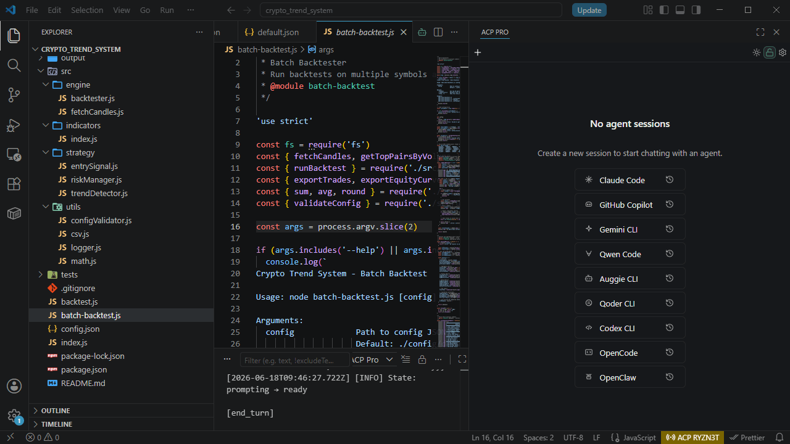

# ACP Pro

**One ACP client for every AI coding agent in VS Code.**

ACP Pro brings Agent Client Protocol coding agents into one VS Code workspace. Run the built-in Claude Code, Codex, Grok Build, OpenCode, GitHub Copilot, Qwen Code, Auggie, Qoder, and OpenClaw agents—or add another ACP-compatible agent—while keeping every task’s context isolated in its own tab.

[Product website](https://acp-pro.github.io) · [Visual Studio Marketplace](https://marketplace.visualstudio.com/items?itemName=duclvz.acp-pro) · [Open VSX](https://open-vsx.org/extension/duclvz/acp-pro) · [Pro license](https://duclvz.gumroad.com/l/acp-pro)

Current release: **0.3.2** — unified session switching, bounded live sessions, per-tab working directories and forks, interactive Mermaid diagrams, durable attachment previews, and a dedicated Settings editor.



## One workspace, many agents

Pick the best agent for each task without moving between separate terminals or chat products. ACP Pro ships nine built-in agents, can browse the growing ACP Registry, and keeps Live and Recent conversations together in one searchable session switcher.

Each tab carries its own:

- Searchable live and restorable conversation history, including attachment previews
- Agent, model, permission mode, and advertised controls
- Working directory, git context, and one-click session forking
- Plan, tool activity, diffs, and usage details
- Preserved transcript position and bottom-follow intent

Live agent processes stay under a configurable cap. Finished, unattended sessions can dehydrate after an idle timeout without interrupting active work, drafts, permission prompts, or remotely viewed sessions.

## Work you can inspect

ACP Pro keeps agent execution visible instead of reducing a run to its final answer. Plans stay readable, tool calls stream with status, file changes render as diffs, and GitHub-Flavored Markdown streams without flicker with highlighted code, LaTeX, clickable paths, and horizontally scrollable tables. Completed Mermaid fences become responsive diagrams with pan, zoom, source-copy, and SVG-export controls, while unfinished or invalid source remains readable.

You can prompt with slash commands and skills, mention files or line ranges, attach context, send the active editor selection directly to a session, queue follow-ups mid-stream, or schedule the current draft with a compact timer such as `4m` or `1h4m`. Attachment previews resolve again across clients and restored sessions, with metadata retained when the original data is unavailable.

Settings opens as a reusable VS Code editor tab with dedicated agent, appearance, license, and About sections backed by extension metadata. Session-level model, permission, and advertised agent controls remain close to the conversation.

## A live workspace that follows you

Remote browser access is useful for more than teammate screen sharing. Open the same live workspace from a desktop or phone browser to check a long-running task after stepping away, respond when the agent needs you, or invite someone else to review the evidence. Narrow layouts keep tabs, toolbar actions, and the More menu reachable.

Browser access stays workspace-scoped and supports share-code authentication. Client-local browser preferences remain separate from VS Code-only configuration. Pro controls add a persistent access code, owner password, and read-only/full-write mode so access can be elevated deliberately or disabled for workspaces that should remain local.

## Install

Install ACP Pro from either extension registry:

- [Visual Studio Marketplace](https://marketplace.visualstudio.com/items?itemName=duclvz.acp-pro)
- [Open VSX](https://open-vsx.org/extension/duclvz/acp-pro) for VS Code-compatible editors such as Cursor, Windsurf, and Trae

The core agent workflow is free to install and use. A [Pro license](https://duclvz.gumroad.com/l/acp-pro) unlocks the optional browser-access controls described above.

## About this repository

This repository contains the static product website published at [acp-pro.github.io](https://acp-pro.github.io). It uses Astro and Tailwind CSS v4 and deploys to GitHub Pages without a server runtime.

### Local development

```bash
pnpm install
pnpm dev
pnpm build
pnpm preview
```

Pushing `main` runs [the deployment workflow](.github/workflows/deploy.yml), builds the static output, and publishes `dist/` to GitHub Pages.

## Author

ACP Pro is built by [@duclvz](https://github.com/duclvz).
